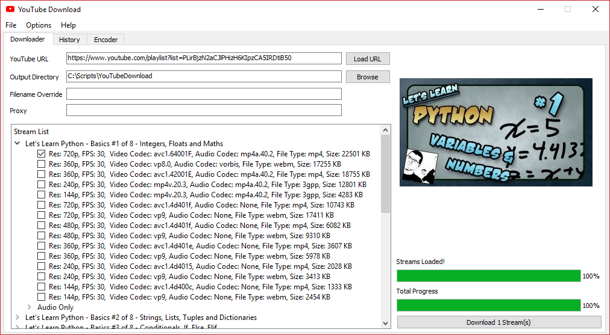
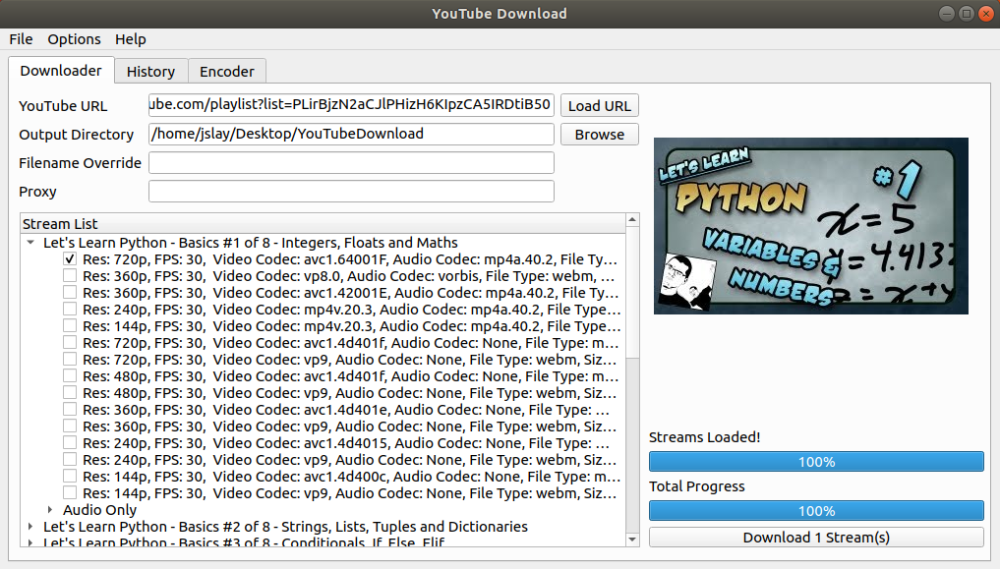
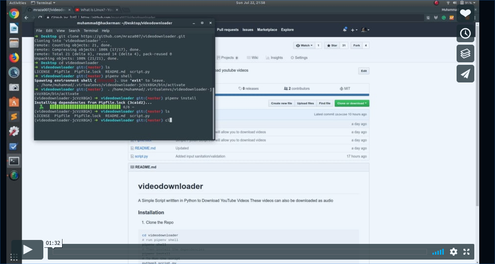

# Getting Started

### Installation
1. Clone the Repo
```Bash
cd videodownloader
# run pipenv shell
pipenv shell
# Then install the dependencies
pipenv install
# To Run the script 
python3 script.py
```

### Usage

You can either run the GUI (`gui.py`), the script (`script.py`) directly for interactive mode,
or use the command line arguments on the script (`script.py`).

    python3 gui.py
    python3 script.py
    python3 script.py -u rfscVS0vtbw -l
    python3 script.py -u rfscVS0vtbw -o videos/ -f my_downloaded_video
    python3 script.py -u rfscVS0vtbw -i 278 -o videos/ -f my_downloaded_itag_video
    python3 script.py -u rfscVS0vtbw -o audio/ -f my_downloaded_audio --audio-only
    python3 script.py --help
    
    -u --url            YouTube URL or YouTube Video ID to download
    -l --list-streams   List available streams for this YouTube Video 
                        instead of download. Use -a/--audio-only to list audio streams.
                        Download specific stream with the 
                        itag ID and -i/--itag argument.
    -i --itag           Stream ITAG to download for given YouTube Video/ID.
                        List streams with -l/--list-streams argument.
                        If ITAG is not provided, default stream will be downloaded.
                        Downloading with ITAG ignores -a/--audio-only.
    -o --output-path    Output Directory Path
    -f --filename       Override the output filename. Does not override file extension
    -p --proxy          Proxy to use. Ex http://xxx.xxx.xxx:8080. NOTE: You need https proxy for https URL!
    -a --audio-only     Download Audio Only
    

**NOTE:** If you are using a proxy, you need https proxy for https URL!



Here's the demo on how to use it

<div align="center">
  <a href="https://vimeo.com/281200561"></a><br>
</div>

### Building Windows EXE

If you want to build the Windows EXE manually, make sure you have pywin32 installed,
as well as pyinstaller. Then run the following command from the script directory.

    pyinstaller --clean --onefile pyinstaller.spec
    
The EXE will be put into the `dist` directory within the script directory.
